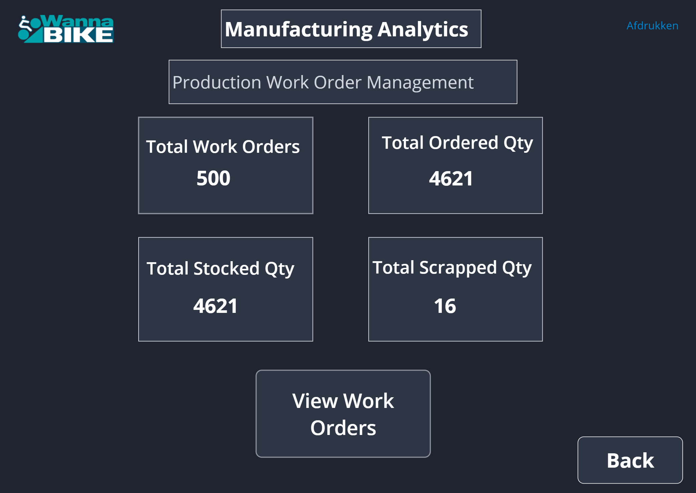
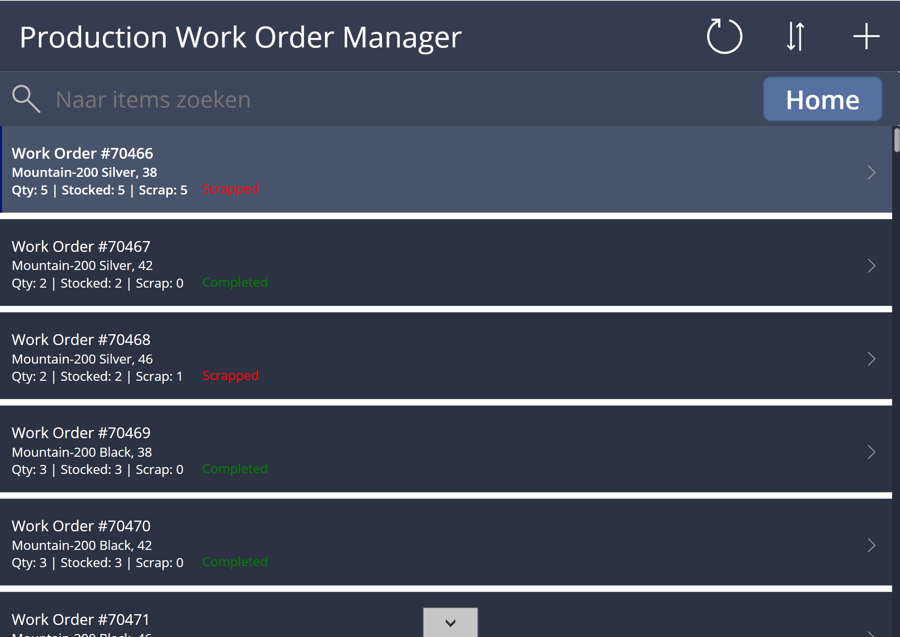
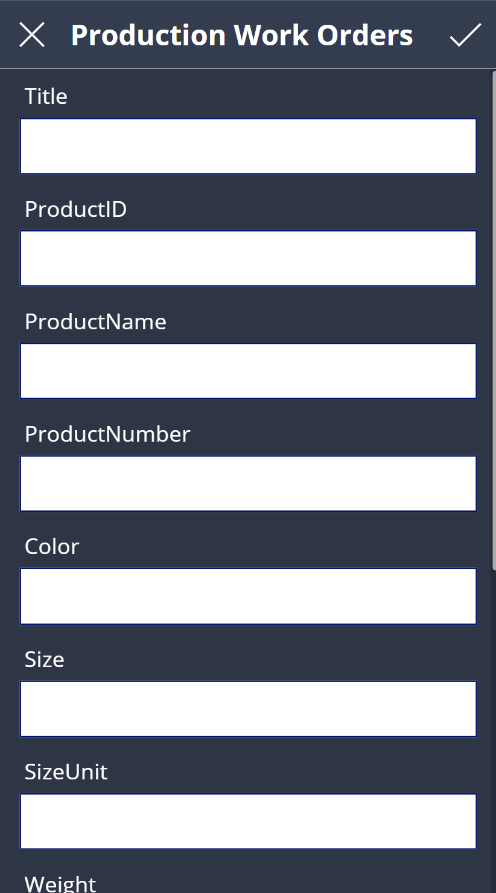
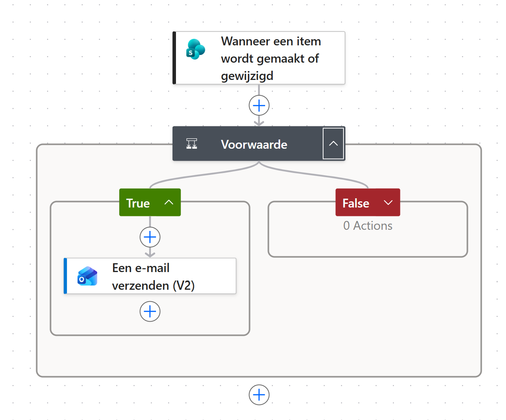
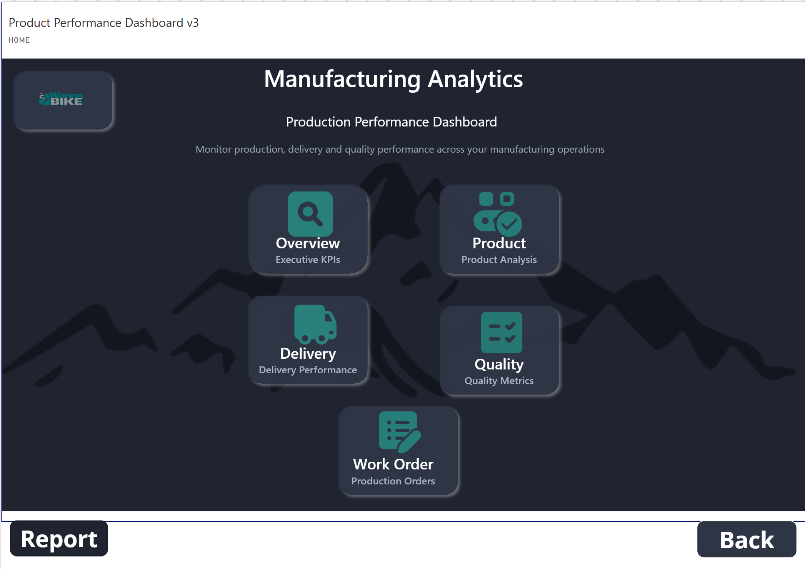

````md
# Power Platform Production Demo

An integrated Microsoft Power Platform demo combining **Power Apps, Power Automate and Power BI** in a production management scenario.

The project demonstrates how multiple Microsoft Power Platform components can work together to support production registration, workflow automation and analytics.

## Overview

The solution is built around a fictional production environment for WannaBike.

It brings together:

- Power Apps for production work order management
- Power Automate for automated alerts
- Power BI for production analytics and KPI monitoring
- SharePoint-based data integration

The goal is to demonstrate how these tools can be used as one connected business solution rather than as separate applications.

## Business Scenario

The production environment requires a simple way to:

- View and manage production work orders
- Register production information
- Create and edit work orders
- Identify completed and scrapped orders
- Trigger automated notifications based on production conditions
- Monitor production KPIs and performance
- Provide users with one central interface for operational and analytical tasks

## Solution Architecture

```text
Production Data
      |
      v
SharePoint / Data Source
      |
      +----------------------+
      |                      |
      v                      v
 Power Apps            Power Automate
      |                      |
      |                 Conditional Alerts
      |                      |
      +----------+-----------+
                 |
                 v
              Power BI
                 |
                 v
        Production Analytics
````

## Power Apps

The Canvas App provides the main user interface for the solution.

Main functions include:

* Central production improvement hub
* Production work order overview
* Search and navigation
* Work order creation and editing
* Status visualization
* KPI navigation
* Integration with analytics and automation components

The app provides a clear distinction between production records such as completed and scrapped work orders.

## Work Order Management

Users can view and manage production work orders directly from the application.

The work order manager includes:

* Work order number
* Product information
* Ordered quantity
* Stocked quantity
* Scrap quantity
* Production status
* Search functionality
* Record navigation
* New work order creation

Status indicators make it easier to identify completed and scrapped work orders.

## Power Automate

Automated cloud flows are used to react to production data changes.

Examples include:

* Late Work Order Alert
* Scrap Alert

The automation process follows a simple business rule:

```text
Item created or modified
        |
        v
Evaluate condition
        |
    +---+---+
    |       |
   True    False
    |
    v
Send automated email
```

This demonstrates how operational production data can automatically trigger notifications without manual intervention.

## Power BI

Power BI provides the analytical layer of the solution.

The dashboard supports analysis of:

* Production volumes
* Delivery performance
* Scrap rates
* Product performance
* Work orders
* Quality KPIs

The Power BI component allows users to move from operational work order management to management-level analysis.

## Technologies

* Microsoft Power Apps
* Microsoft Power Automate
* Microsoft Power BI
* Microsoft SharePoint
* Microsoft Power Platform
* Canvas Apps
* Automated Cloud Flows
* Business Process Automation
* Data Visualization
* Production Analytics

## Screenshots

### Production Improvement Hub

Central navigation screen connecting work order management, automation and analytics.



### Work Order Manager

Production work orders with status indicators for completed and scrapped records.



### Create Work Order

Canvas App form used to register new production work orders.



### Power Automate Flow

Conditional cloud flow that evaluates production data and sends an automated email notification.



### Power BI Analytics

Power BI integration for production, delivery, quality and work-order analysis.



## Business Value

This solution demonstrates how Microsoft Power Platform can be used to create an integrated production workflow.

The combination of Power Apps, Power Automate and Power BI makes it possible to:

* Digitize operational data entry
* Reduce manual follow-up
* Automatically notify users when predefined conditions occur
* Provide management with up-to-date KPI insights
* Connect operational workflows with analytical reporting
* Improve visibility across the production process

## Project Goal

This portfolio project demonstrates how **Power Apps, Power Automate and Power BI can be combined into one practical business solution** for production management, workflow automation and analytics.

## Project Status

Completed portfolio demo focused on Microsoft Power Platform integration, production workflow management, automation and Business Intelligence.

```


